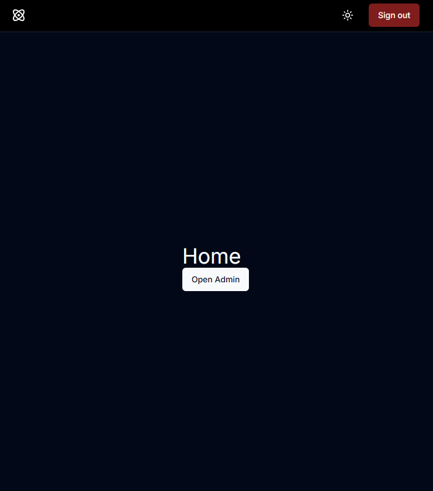
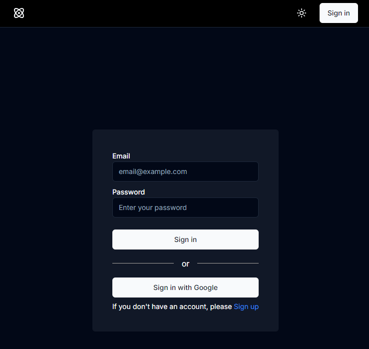
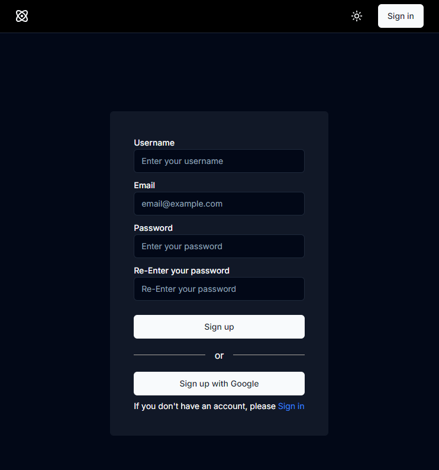
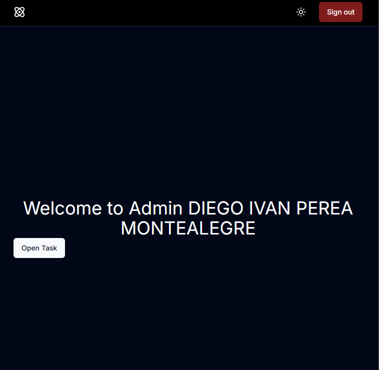
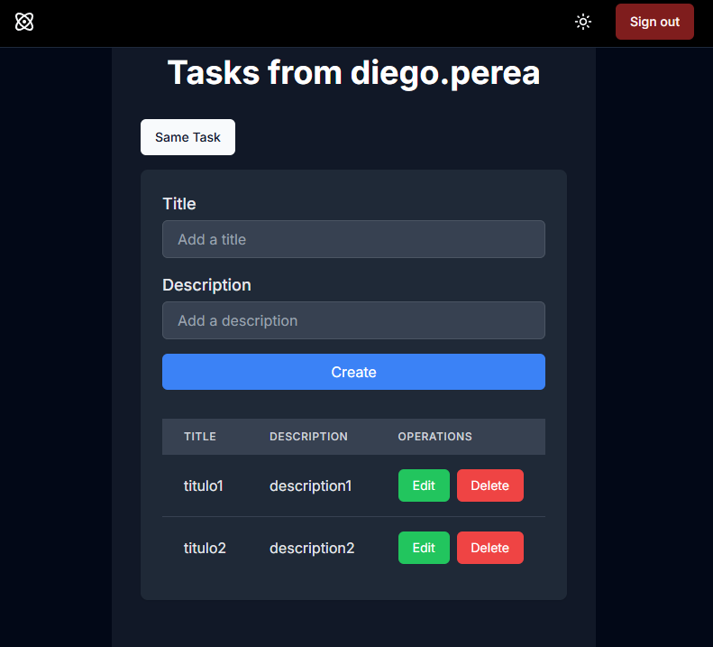
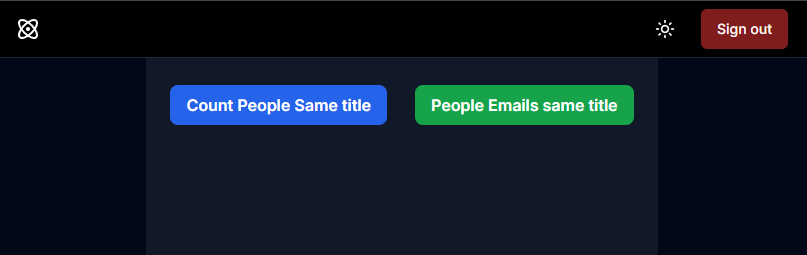
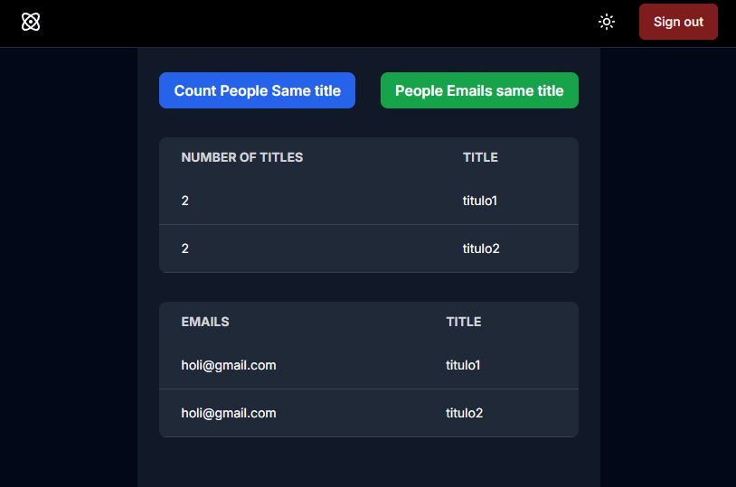
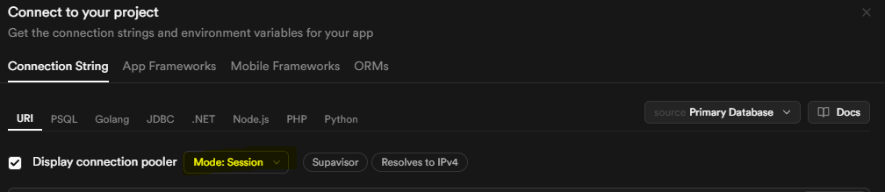

### Nextjs prisma tasks ts

<p align="justify">
Nextjs create task and match titles with login of google or a custom system, with Prisma and typescript Tailwind.
</p>

<p align="justify">
This repository uses Next.js to build the task creation and title matching app, with authentication via Google or a custom system, managed by Prisma as the ORM, and developed in TypeScript to ensure robust and scalable code.
</p>

Home
<p align="center">
  
</p>

Sig in Dark
<p align="center">
  
</p>

Sig up Dark
<p align="center">
  
</p>

Admin
<p align="center">
  
</p>

Tasks
<p align="center">
  
</p>

Same buttons
<p align="center">
  
</p>

Same 
<p align="center">
  
</p>

-----

Fronted Nextjs Options for do it:

This is a [Next.js](https://nextjs.org/) project bootstrapped with [`create-next-app`](https://github.com/vercel/next.js/tree/canary/packages/create-next-app).

## Getting Started
Nodejs version v20.18.0 and Next.js version v13.4.12

First
```bash
npm install
```
run the development server:

```bash
npm run dev
# or
yarn dev
# or
pnpm dev
# or
bun dev
```

Open [http://localhost:3000](http://localhost:3000) with your browser to see the result.

> **Note:** In Supabase, set the connection to **session mode**. It does not work in **transition mode**.

[Supabase](https://supabase.com/)

<p align="center">
  
</p>

### Prism Commands

`npx prisma migrate dev --name init`

```bash
npx prisma migrate dev --name init
```

This command is used to **create and apply migrations** in a development environment.

`npx prisma db push`

```bash
npx prisma db push
```

On the other hand, the `npx prisma db push` command is used to **directly synchronize the Prisma schema with the database** without creating migration files.

----
Please uncommeted the .env in gitignore if you do deploy

> **Note:** In the file `.env`, set the `NEXTAUTH_SECRET` to the generated number from the [secret generator](https://generate-secret.vercel.app/32) or [visit documentation](https://next-auth.js.org/deployment#vercel) for more information.

[Similar Project](https://github.com/diegoperea20/Nextjs-and-Prisma-with-Login-create-Tasks)

Created by [Diego Ivan Perea Montealegre](https://github.com/diegoperea20)

---
